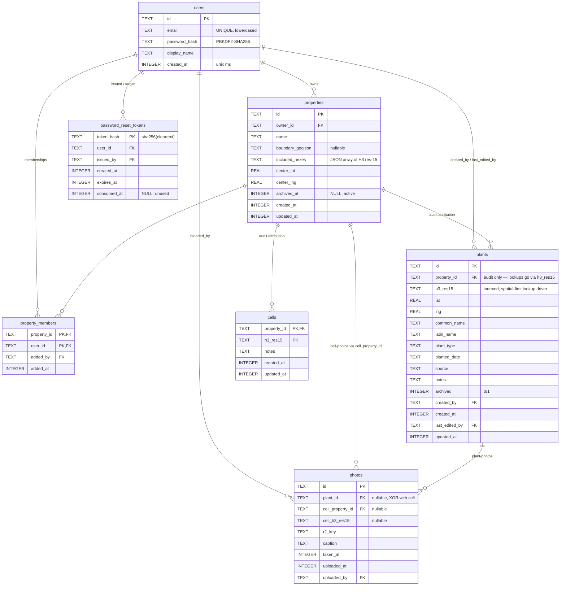

# Arboretum Mapper — Database Schema

D1 (SQLite). Reflects migrations 0001–0007. See [`arboretum_prd.md`](./arboretum_prd.md) §8.4 for the high-level spec.

## ER diagram

## Key invariants

- **Spatial-first lookup**: `plants` and `photos` are queried by `h3_res15 IN (property.included_hexes)`, not by `property_id`. The `property_id` column on plants/cells/photos is audit-only; archived-property data resurfaces under any new property covering the same hex set (see PRD §6.1).
- **Photo XOR**: a `photos` row has either `plant_id` or both `cell_property_id`+`cell_h3_res15`, never both, never neither — enforced by two `CHECK` constraints in migration 0006.
- **Reset tokens**: stored as `sha256(token)`; the cleartext lives only in the URL emitted once by the admin tool. A DB read leak does not yield working reset links.
- **Email casing**: stored as-typed but uniqueness enforced via a unique index on `lower(email)` (see migration 0001).
- **All timestamps**: `INTEGER` storing Unix epoch in milliseconds (`Date.now()`), except `plants.planted_date` which is a free-text human date.

## Indexes

| Index                          | Table                 | Purpose                                 |
| ------------------------------ | --------------------- | --------------------------------------- |
| `idx_users_email_lower`        | users                 | Case-insensitive email lookup at login  |
| `idx_properties_owner`         | properties            | "Properties I own"                      |
| `idx_properties_archived_at`   | properties            | Filter active vs archived               |
| `idx_property_members_user`    | property_members      | "Properties I'm a member of"            |
| `idx_plants_h3`                | plants                | Spatial-first lookup                    |
| `idx_plants_property_archived` | plants                | "All plants in property X" backup query |
| `idx_cells_h3`                 | cells                 | Cell lookup                             |
| `idx_photos_plant`             | photos                | Plant timeline                          |
| `idx_photos_cell`              | photos                | Cell photo gallery                      |
| `idx_reset_tokens_user`        | password_reset_tokens | Cleanup of a user's tokens              |
